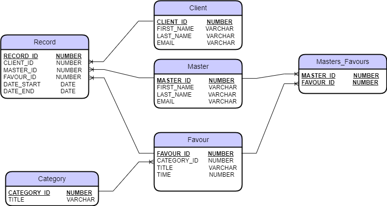

# Project: Application for online registration for procedures
## _Application design:_
* ___Registration___
    * _For the master_
 		* First name, Last name, email, password 

 	* _For the client_
 		* First name, Last name,  email, password

* ___Authorization (by mail)___
	* _For the client_
 	* _For the master_

* ___Client page___
	* _View the list of masters/categories_ 
 	* _Creating record for a favour_
 		* Selection of the master, favour, time 
 		* Formation of a record 
	* _List of records_
		* Cancel an upcoming record 
 

* ___Master page___
	* _Creating favours for various categories_
 	* _List of records_
		* Cancel an upcoming record 
	* _Mailing of promotions by mail_

***
## _Database structure:_
