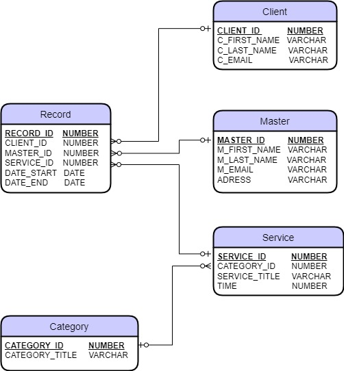

#Project: Application for online registration for procedures
##_Application design:_
* ___Registration (by mail)___
    * _For the master_
 		* First name, Last name, email, studio address 
 		* A list of services (with the time of the procedure)for each category(massage, nails, etc.)

 	* _For the client_
 		* First name, Last name,  email

* ___Authorization (by mail)___
	* _For the client_
 	* _For the master_

* ___Home page___
	 * _Search for services_ 
 		* Displaying service categories when searching
 		* Date selection
 		* Display of suitable masters after the search
 	* _Recording_
 		* Selection of the master, services, time 
 		* Formation of a record with the status: _"awaiting confirmation"_
 

* ___Personal account___
 	* _List of upcoming sessions_
 		* Change the status of the record to _"confirmed"_ (after confirmation of the master)
		* Change the session (date and time)
		* Cancel the session

 	* _List of sessions that have passed_
 		* Rate and leave a review

* ___Mailing of promotions by mail___

***
## _Database structure:_
